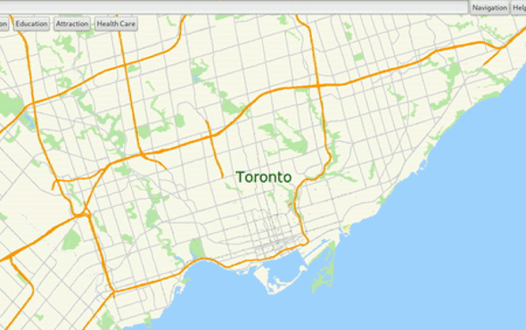

# Mapper  

Source Code Available Upon Demand  

---

## Overview   

This is a Google Maps-like software implemented from scratch using C++ for the backend and GTK3 for the frontend framework. Geographical data is sourced from OpenStreetMap.  

---

## Contributors  

- **Alissa Xiang**  (Me!)
  - Github:[kexinxiang](https://github.com/kexinxiang)
  - LinkedIn: [Kexin Xiang](https://www.linkedin.com/in/alissa-xiang/)
  - Email: kexinxiangx@outlook.com 

- **William Wen**  
  - GitHub: [WilliamJWen](https://github.com/WilliamJWen)  
  - LinkedIn: [JWilliamWen](https://www.linkedin.com/in/jwilliamwen/)  
  - Email: jwilliam.wen@mail.utoronto.com   

- **Holly Han**  
  - Contact Info:  /

---

## Key UI Features  

- **Drop-Down Menu for City Selection**
This feature allows users to switch between maps of different cities, by clicking on the widget at the top right corner of the window. The popup menu is alphabetically ordered, making it easier for users to navigate.

 

- **Intelligent Search Bar with Auto-Completion**

Check out this demo for the intelligent search bar that works with user entering partial street names and always provides a single match.

- **Interactive Navigation Mode**

Our software offers a user-friendly and efficient navigation experience. Users can toggle into navigation mode using the button next to the search bar. Starting and destination intersections can be selected either by clicking directly on the map or using the intelligent search bar. Upon selecting the destination, the system instantly displays:

  - ETA Information
  - Step-by-step Directions (with a scrollable list)

Each step can be visualized by clicking on the corresponding instruction, which highlights the related street on the map.  

Check out the demo to see it in action!

---

## Algorithms  

### Fastest Path Between Two Intersections  
We integrated the **A\* Algorithm** on top of the **Dijkstra Algorithm** and achieved a **3x speed improvement** without sacrificing accuracy by applying well-thought-out heuristics.  

 

### Variation of the Traveling Salesman Problem (TSP)  
Our solution integrates:  
- Multi-Start  
- Probability Greedy Algorithm  
- 2-opt Perturbation  
- Simulated Annealing  

---

## How This Project Was Divided  

The project was divided into four milestones over four months:  

### Milestone 1: Data Organization and API Extension  
- Organized large amounts of data into structured formats.  
- Extended an existing API by implementing functions to support future milestones.  

### Milestone 2: Map Drawing with EZGL  
- Utilized the EZGL graphics library, a wrapper around GTK3 and Cairo.  
- Focused on drawing maps using functions implemented in Milestone 1.  

### Milestone 3: Pathfinding and Directions  
- Implemented pathfinding between two intersections.  
- Designed and created directions accompanying the path found.  

### Milestone 4: Multi-Stop Pathfinding  
- Optimized paths for multiple deliveries and drop-offs.  
- Ensured correct sequencing for pickups and drop-offs, starting and ending at a depot.  

---

## Challenges Faced  

- **Map Display Issues**  
  - *Problem*: Map disrupted by lines connecting different cities.  
  - *Reason*: Used `vector.resize()` with `vector.push_back()`.  

- **GTK Search Bar**  
  - *Solution*: Implemented a global flag.  

- **GTK Pop-Up Window Slide Bar**  
  - *Problem*: A small portion of the pop-up window blocks mouse clicks.  
  - *Result*: Unsolved.  

---

## What I Learned  

- Collaboration using source control tools like Git.  
- Work management using Wiki and Markdown.  
- Effective communication and presentation.  
- User interface (UI) and user experience (UX) design.  
- The world 🌍 is just nodes and edges!  

---

## What I Would Do Differently  

- Adopt object-oriented programming (OOP) principles.  
- Reduce reliance on global variables.  
- Cache the map by splitting it into multiple sections.  
- Unit test every function.  

---

## Refinements for the Existing Code  

- Implement better error handling.  
- Optimize algorithms further.  
- Improve UI responsiveness and accessibility.  

---

## The Potential Future of This Project  

- **Wheelchair Accessibility**: Routes optimized for accessibility needs.  
- **Bike Share Safety**: Safer navigation for cyclists.  
- **Food Delivery Optimization**: Smarter delivery routes.  
- **GPS Drawing**: Creative applications using GPS coordinates.  

---  

Feel free to reach out if you'd like more details about this project!  
